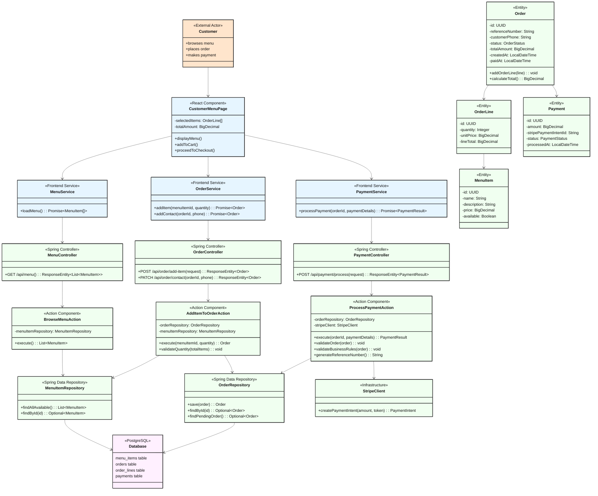
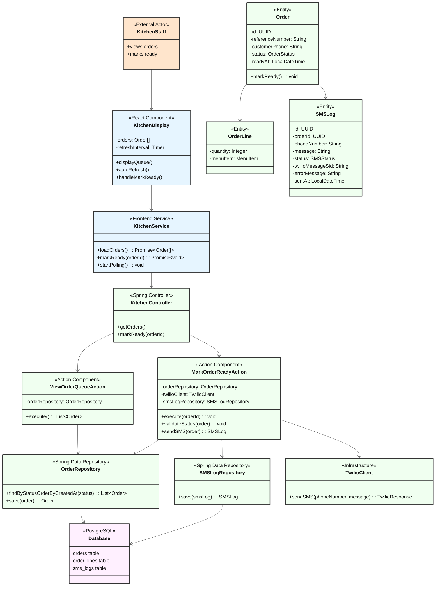
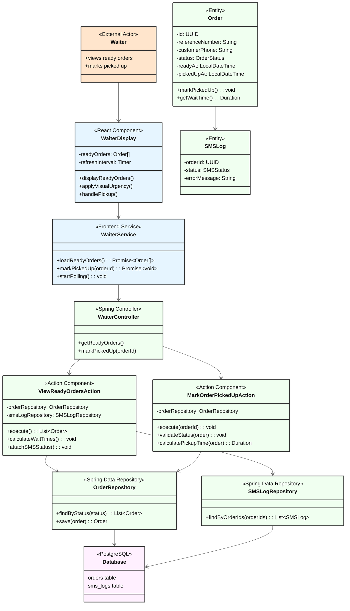

# Architecture Documentation - El Chiringuito

**System**: El Chiringuito Restaurant Ordering System
**Version**: 1.0.0
**Last Updated**: 2025-09-30

## Overview

El Chiringuito is a restaurant ordering system following Mosy framework patterns with a clean layered architecture. The system uses Spring Boot for the backend and React for three frontend interfaces (customer, kitchen, waiter).

### Architecture Principles
- **Synchronous Processing**: All operations execute synchronously without event-driven architecture
- **Action-Oriented**: Actions replace traditional service layer for business logic
- **REST API**: Standard HTTP/JSON communication
- **Separation of Concerns**: Clear boundaries between frontend, backend, and persistence layers

## Overall System Architecture

```mermaid
%%{init: {'theme':'neutral'}}%%
classDiagram
    class Customer {
        <<External Actor>>
    }

    class KitchenStaff {
        <<External Actor>>
    }

    class Waiter {
        <<External Actor>>
    }

    class CustomerMenuPage {
        <<React Component>>
    }

    class KitchenDisplay {
        <<React Component>>
    }

    class WaiterDisplay {
        <<React Component>>
    }

    class MenuService {
        <<Frontend Service>>
    }

    class OrderService {
        <<Frontend Service>>
    }

    class PaymentService {
        <<Frontend Service>>
    }

    class KitchenService {
        <<Frontend Service>>
    }

    class WaiterService {
        <<Frontend Service>>
    }

    class MenuController {
        <<Spring Controller>>
    }

    class OrderController {
        <<Spring Controller>>
    }

    class PaymentController {
        <<Spring Controller>>
    }

    class KitchenController {
        <<Spring Controller>>
    }

    class WaiterController {
        <<Spring Controller>>
    }

    class BrowseMenuAction {
        <<Action Component>>
    }

    class AddItemToOrderAction {
        <<Action Component>>
    }

    class ProcessPaymentAction {
        <<Action Component>>
    }

    class ViewOrderQueueAction {
        <<Action Component>>
    }

    class MarkOrderReadyAction {
        <<Action Component>>
    }

    class ViewReadyOrdersAction {
        <<Action Component>>
    }

    class MarkOrderPickedUpAction {
        <<Action Component>>
    }

    class MenuItemRepository {
        <<Repository>>
    }

    class OrderRepository {
        <<Repository>>
    }

    class SMSLogRepository {
        <<Repository>>
    }

    class StripeClient {
        <<Infrastructure>>
    }

    class TwilioClient {
        <<Infrastructure>>
    }

    class MenuItem {
        <<Entity>>
    }

    class Order {
        <<Entity>>
    }

    class OrderLine {
        <<Entity>>
    }

    class Payment {
        <<Entity>>
    }

    class SMSLog {
        <<Entity>>
    }

    class Database {
        <<PostgreSQL>>
    }

    Customer --> CustomerMenuPage
    CustomerMenuPage --> MenuService
    CustomerMenuPage --> OrderService
    CustomerMenuPage --> PaymentService
    MenuService --> MenuController
    OrderService --> OrderController
    PaymentService --> PaymentController
    MenuController --> BrowseMenuAction
    OrderController --> AddItemToOrderAction
    PaymentController --> ProcessPaymentAction
    BrowseMenuAction --> MenuItemRepository
    AddItemToOrderAction --> OrderRepository
    AddItemToOrderAction --> MenuItemRepository
    ProcessPaymentAction --> OrderRepository
    ProcessPaymentAction --> StripeClient

    KitchenStaff --> KitchenDisplay
    KitchenDisplay --> KitchenService
    KitchenService --> KitchenController
    KitchenController --> ViewOrderQueueAction
    KitchenController --> MarkOrderReadyAction
    ViewOrderQueueAction --> OrderRepository
    MarkOrderReadyAction --> OrderRepository
    MarkOrderReadyAction --> TwilioClient
    MarkOrderReadyAction --> SMSLogRepository

    Waiter --> WaiterDisplay
    WaiterDisplay --> WaiterService
    WaiterService --> WaiterController
    WaiterController --> ViewReadyOrdersAction
    WaiterController --> MarkOrderPickedUpAction
    ViewReadyOrdersAction --> OrderRepository
    ViewReadyOrdersAction --> SMSLogRepository
    MarkOrderPickedUpAction --> OrderRepository

    MenuItemRepository --> Database
    OrderRepository --> Database
    SMSLogRepository --> Database
    Order --> OrderLine
    OrderLine --> MenuItem
    Order --> Payment
    Order --> SMSLog

    style Customer fill:#ffe5cc,stroke:#333,stroke-width:2px
    style KitchenStaff fill:#ffe5cc,stroke:#333,stroke-width:2px
    style Waiter fill:#ffe5cc,stroke:#333,stroke-width:2px
    style CustomerMenuPage fill:#e6f5ff,stroke:#333,stroke-width:2px
    style KitchenDisplay fill:#e6f5ff,stroke:#333,stroke-width:2px
    style WaiterDisplay fill:#e6f5ff,stroke:#333,stroke-width:2px
    style MenuService fill:#e6f5ff,stroke:#333,stroke-width:2px
    style OrderService fill:#e6f5ff,stroke:#333,stroke-width:2px
    style PaymentService fill:#e6f5ff,stroke:#333,stroke-width:2px
    style KitchenService fill:#e6f5ff,stroke:#333,stroke-width:2px
    style WaiterService fill:#e6f5ff,stroke:#333,stroke-width:2px
    style MenuController fill:#f0fff0,stroke:#333,stroke-width:2px
    style OrderController fill:#f0fff0,stroke:#333,stroke-width:2px
    style PaymentController fill:#f0fff0,stroke:#333,stroke-width:2px
    style KitchenController fill:#f0fff0,stroke:#333,stroke-width:2px
    style WaiterController fill:#f0fff0,stroke:#333,stroke-width:2px
    style BrowseMenuAction fill:#f0fff0,stroke:#333,stroke-width:2px
    style AddItemToOrderAction fill:#f0fff0,stroke:#333,stroke-width:2px
    style ProcessPaymentAction fill:#f0fff0,stroke:#333,stroke-width:2px
    style ViewOrderQueueAction fill:#f0fff0,stroke:#333,stroke-width:2px
    style MarkOrderReadyAction fill:#f0fff0,stroke:#333,stroke-width:2px
    style ViewReadyOrdersAction fill:#f0fff0,stroke:#333,stroke-width:2px
    style MarkOrderPickedUpAction fill:#f0fff0,stroke:#333,stroke-width:2px
    style MenuItemRepository fill:#f0fff0,stroke:#333,stroke-width:2px
    style OrderRepository fill:#f0fff0,stroke:#333,stroke-width:2px
    style SMSLogRepository fill:#f0fff0,stroke:#333,stroke-width:2px
    style StripeClient fill:#f0fff0,stroke:#333,stroke-width:2px
    style TwilioClient fill:#f0fff0,stroke:#333,stroke-width:2px
    style MenuItem fill:#f0fff0,stroke:#333,stroke-width:2px
    style Order fill:#f0fff0,stroke:#333,stroke-width:2px
    style OrderLine fill:#f0fff0,stroke:#333,stroke-width:2px
    style Payment fill:#f0fff0,stroke:#333,stroke-width:2px
    style SMSLog fill:#f0fff0,stroke:#333,stroke-width:2px
    style Database fill:#fff0ff,stroke:#333,stroke-width:2px
```



## Component Legend

- 🟧 **External Actors** (Orange) - Users interacting with the system
- 🟦 **Frontend Components** (Light Blue) - React components and services
- 🟩 **Backend Components** (Light Green) - Spring Boot controllers, actions, repositories, entities
- 🟪 **Database** (Light Purple) - PostgreSQL persistence layer

## Flow-Specific Architecture Diagrams

### PlaceOrderFlow Architecture



### ProcessOrderFlow Architecture



### ManagePickupFlow Architecture



## Component Descriptions

### Frontend Layer (Light Blue)

#### React Components
- **CustomerMenuPage**: Customer-facing interface for browsing menu, adding items, checkout, and payment
- **KitchenDisplay**: Kitchen staff interface showing order queue with auto-refresh (5s interval)
- **WaiterDisplay**: Waiter interface showing ready orders with visual urgency indicators

#### Frontend Services
- **MenuService**: API communication for menu data retrieval
- **OrderService**: API communication for order management (add items, contact)
- **PaymentService**: Stripe integration and payment processing
- **KitchenService**: Polling service for order queue updates
- **WaiterService**: Polling service for ready orders with wait time calculation

### Backend Layer (Light Green)

#### Controllers (HTTP Request Handling)
- **MenuController**: Handles menu browsing requests
- **OrderController**: Handles order item and contact management
- **PaymentController**: Handles payment processing requests
- **KitchenController**: Handles kitchen order queue and ready marking
- **WaiterController**: Handles ready orders viewing and pickup confirmation

#### Actions (Business Logic - Replaces Service Layer)
- **BrowseMenuAction**: Retrieves available menu items
- **AddItemToOrderAction**: Validates and adds items to order with quantity checks
- **ProcessPaymentAction**: Complete payment flow including validation, Stripe processing, and order confirmation
- **ViewOrderQueueAction**: Retrieves PREPARING orders in FIFO order
- **MarkOrderReadyAction**: Updates order status and sends SMS notification synchronously
- **ViewReadyOrdersAction**: Retrieves READY orders with wait times and SMS status
- **MarkOrderPickedUpAction**: Marks order as picked up and calculates pickup time

#### Repositories (Data Access)
- **MenuItemRepository**: CRUD operations for menu items
- **OrderRepository**: CRUD and query operations for orders
- **SMSLogRepository**: CRUD operations for SMS logs

#### Infrastructure Components
- **StripeClient**: Integration with Stripe Payment API (test mode)
- **TwilioClient**: Integration with Twilio SMS API (test mode)

#### Entities (Domain Model)
- **MenuItem**: Menu item with price and availability
- **Order**: Customer order with status lifecycle
- **OrderLine**: Individual items within order
- **Payment**: Payment transaction record
- **SMSLog**: SMS notification audit log

#### Enumerations
- **OrderStatus**: PENDING, PREPARING, READY, PICKED_UP
- **PaymentStatus**: PENDING, SUCCESS, FAILED
- **SMSStatus**: SENT, FAILED

### Persistence Layer (Light Purple)

#### Database
- **PostgreSQL** (production) / **H2** (development)
- Tables: menu_items, orders, order_lines, payments, sms_logs
- Indexes on status, timestamps, and foreign keys for performance

## Architecture Layers Explained

### Frontend Layer Pattern
```
User Interaction → React Component → Frontend Service → REST API Call
```

**Characteristics**:
- Components manage UI state and user interactions
- Services handle API communication and data transformation
- Frontend services are acceptable (unlike backend services which are replaced by Actions)
- Polling-based refresh for kitchen and waiter displays

### Backend Layer Pattern (Mosy Framework)
```
HTTP Request → Controller → Action → Repository → Database
```

**Key Differences from Traditional Architecture**:
- **NO Service Layer**: Actions replace traditional services
- **Action-Oriented**: All business logic in Actions
- **Direct Delegation**: Controllers directly invoke Actions
- **Actor Context**: Each action operates with actor context (CustomerActor, KitchenStaffActor, etc.)

### Persistence Layer Pattern
```
Repository → JPA/Hibernate → PostgreSQL
```

**Characteristics**:
- Spring Data JPA repositories
- Entity relationships managed by JPA
- Database transactions ensure consistency
- Indexes optimize query performance

## Design Patterns Used

### Mosy Actor-Action Pattern
- **Actions replace Service layer**: All business logic in Action classes
- **Actor context**: Each action executes with actor context
- **Clear responsibility**: Controllers route, Actions execute business logic
- **Testable**: Actions are stateless and easily testable

### Repository Pattern
- **Data access abstraction**: Hide database implementation details
- **Spring Data JPA**: Automatic CRUD implementation
- **Custom queries**: Support for complex filtering and sorting
- **Transaction management**: Spring-managed transactions

### Synchronous Request-Response
- **No events**: All processing synchronous within HTTP request
- **Immediate feedback**: User receives immediate success/failure response
- **Simple debugging**: Linear execution flow
- **Database transactions**: ACID guarantees for consistency

### Frontend Polling Pattern
- **Kitchen Display**: Auto-refresh every 5 seconds for order queue
- **Waiter Display**: Periodic polling for ready orders
- **Simple implementation**: No WebSockets or Server-Sent Events needed
- **Eventual consistency**: Updates visible within polling interval

## Technology Stack

### Frontend
- **React 18+**: UI framework
- **TypeScript**: Type-safe JavaScript
- **Axios**: HTTP client for API calls
- **React Router**: Client-side routing for three interfaces
- **CSS/Tailwind**: Styling and visual urgency indicators

### Backend
- **Spring Boot 3.x**: Application framework
- **Spring Web (MVC)**: REST API endpoints
- **Spring Data JPA**: Repository layer
- **Java 17+**: Programming language
- **Maven**: Build tool

### External Services
- **Stripe API**: Payment processing (test mode with test cards)
- **Twilio API**: SMS notifications (test mode with test numbers)

### Database
- **H2**: In-memory database for development/testing
- **PostgreSQL**: Production database

### Tools
- **Lombok**: Reduce boilerplate code
- **MapStruct**: Object mapping
- **JUnit 5**: Testing framework
- **Mockito**: Mocking framework

## API Contracts

### REST API Specification

The complete REST API specification is documented in OpenAPI 3.0 format:

📄 **[OpenAPI Specification](./openapi-spec.yaml)**

### Key Endpoints

#### Customer APIs
- `GET /api/menu` - Browse available menu items
- `POST /api/order/add-item` - Add item to order
- `PATCH /api/order/contact` - Add customer phone number
- `POST /api/payment/process` - Process payment via Stripe

#### Kitchen APIs
- `GET /api/kitchen/orders` - Get order queue (PREPARING status)
- `POST /api/kitchen/mark-ready/{orderId}` - Mark order ready and send SMS

#### Waiter APIs
- `GET /api/waiter/ready-orders` - Get ready orders with wait times
- `POST /api/waiter/mark-picked-up/{orderId}` - Mark order as picked up

## Configuration

### Application Properties

```properties
# Server
server.port=8080

# Database
spring.datasource.url=jdbc:postgresql://localhost:5432/el_chiringuito
spring.datasource.username=${DB_USERNAME}
spring.datasource.password=${DB_PASSWORD}
spring.jpa.hibernate.ddl-auto=validate
spring.jpa.show-sql=false

# Flyway Migration
spring.flyway.enabled=true
spring.flyway.locations=classpath:db/migration

# Stripe
stripe.api.key=${STRIPE_API_KEY}
stripe.api.test-mode=true

# Twilio
twilio.account.sid=${TWILIO_ACCOUNT_SID}
twilio.auth.token=${TWILIO_AUTH_TOKEN}
twilio.phone.number=${TWILIO_PHONE_NUMBER}
twilio.test-mode=true

# Business Rules
business.operating-hours.start=11:30
business.operating-hours.end=23:30
business.order.max-items=50

# Frontend Polling
kitchen.refresh-interval=5000
waiter.refresh-interval=5000
```

## Security Considerations

### Authentication & Authorization
- **Phase 1 (Current)**: No authentication (QR code access is implicit authorization)
- **Future**: Add staff authentication for kitchen/waiter interfaces

### Data Protection
- **HTTPS**: Required for production (protects payment data)
- **Stripe**: PCI-compliant payment processing
- **Phone Numbers**: Stored securely, not exposed in logs
- **SQL Injection**: Prevented by JPA parameterized queries

### External API Security
- **Stripe**: API keys stored in environment variables
- **Twilio**: Credentials stored in environment variables
- **Test Mode**: Development uses test credentials

## Deployment Architecture

### Development
```
Local Machine:
├── Frontend (React Dev Server, Port 5173)
├── Backend (Spring Boot, Port 8080)
└── Database (H2 in-memory or PostgreSQL)
```

### Production (Future)
```
Cloud Infrastructure:
├── Frontend: Static hosting (Netlify/Vercel)
├── Backend: Container (Docker) on cloud platform
├── Database: Managed PostgreSQL (AWS RDS/Heroku)
├── Stripe: Production API
└── Twilio: Production API
```

## Performance Considerations

### Database Indexes
- `orders.status` - Fast filtering by order status
- `orders.created_at` - FIFO ordering in kitchen queue
- `orders.ready_at` - Sorting ready orders for waiter
- Foreign key indexes for JOIN performance

### Caching Strategy
- **Menu Items**: Can be cached (rarely change)
- **Orders**: No caching needed (real-time data)
- **Frontend polling**: Natural caching via refresh interval

### Scalability
- **Stateless backend**: Horizontal scaling possible
- **Database**: PostgreSQL can handle single restaurant load
- **External APIs**: Stripe/Twilio handle scaling

## Error Handling

### Frontend Error Handling
- User-friendly error messages
- Retry mechanisms for failed API calls
- Loading states during API calls
- Form validation before submission

### Backend Error Handling
- Global exception handler
- Appropriate HTTP status codes
- Detailed error messages for debugging
- Transaction rollback on errors

### External API Error Handling
- Stripe failures: Return error to user for retry
- SMS failures: Log error, mark SMS as FAILED, continue order processing
- Network errors: Return 500, allow retry

---

© 2025 Mosy Software Architecture SL. All rights reserved.

Licensed to AgentGuild customers for internal use only. Distribution, copying, or derivative works prohibited without written permission. Contact: legal@mosy.tech