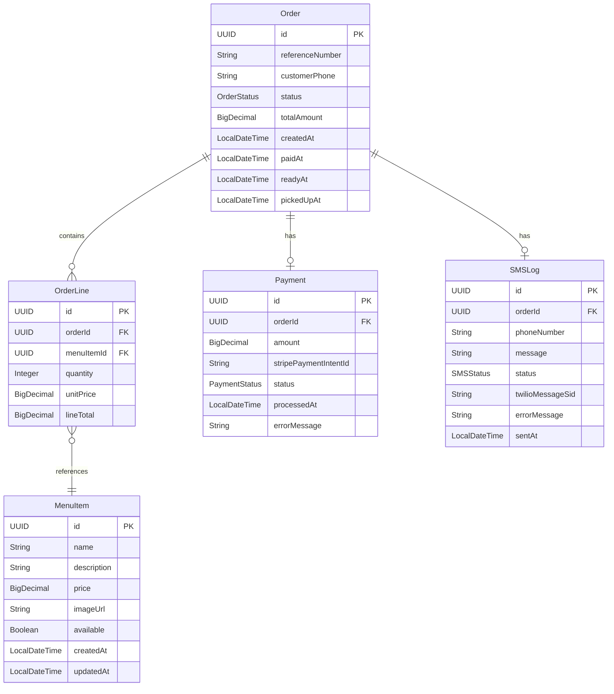

# Entity Model - El Chiringuito

**System**: El Chiringuito Restaurant Ordering System
**Version**: 1.0.0
**Last Updated**: 2025-09-30

## Entity Relationship Diagram



## Entity Specifications

### MenuItem

**Description**: Represents a menu item available for ordering at the restaurant. Menu items are loaded via SQL migration files and represent the restaurant's product catalog.

**Attributes**:
- **id** (UUID): Unique identifier, auto-generated primary key
- **name** (String): Name of the menu item
  - Required field
  - Maximum length: 100 characters
  - Example: "Paella Valenciana", "Tortilla Española"
- **description** (String): Detailed description of the item
  - Optional field
  - Maximum length: 500 characters
  - Example: "Traditional Spanish rice dish with seafood"
- **price** (BigDecimal): Price of the item in euros
  - Required field
  - Precision: 10, Scale: 2
  - Must be > 0
  - Example: 12.50
- **imageUrl** (String): URL to item image
  - Optional field
  - Maximum length: 500 characters
  - Used for customer menu display
- **available** (Boolean): Whether item is currently available for ordering
  - Required field
  - Default value: true
  - Can be toggled to temporarily disable items
- **createdAt** (LocalDateTime): When the menu item was created
  - Automatically set by system
  - Cannot be modified
- **updatedAt** (LocalDateTime): Last update timestamp
  - Automatically updated by system

**Business Rules**:
- Menu items are loaded from SQL migration files during deployment
- Price must be greater than 0
- Unavailable items don't appear in customer menu
- Cannot be deleted, only marked as unavailable
- Name must be unique within the menu

### Order

**Description**: Represents a customer order containing one or more menu items. Tracks the complete lifecycle from creation through pickup.

**Attributes**:
- **id** (UUID): Unique identifier, auto-generated primary key
- **referenceNumber** (String): Human-readable order reference
  - Generated after successful payment
  - Format: "ORD-" + timestamp-based unique number
  - Example: "ORD-20250930-001"
  - Displayed to customer and kitchen/waiter staff
- **customerPhone** (String): Customer's phone number for SMS notification
  - Required before payment
  - Format: International format recommended (e.g., +34612345678)
  - Maximum length: 20 characters
  - Used for SMS notifications
- **status** (OrderStatus Enum): Current state of the order
  - Possible values: PENDING, PREPARING, READY, PICKED_UP
  - Default value: PENDING
  - State transitions documented below
- **totalAmount** (BigDecimal): Total order amount
  - Calculated as sum of all OrderLine.lineTotal
  - Precision: 10, Scale: 2
  - Includes all items in the order
- **createdAt** (LocalDateTime): When order was first created
  - Automatically set when first item added
  - Cannot be modified
- **paidAt** (LocalDateTime): When payment was successfully processed
  - Set when Payment status becomes SUCCESS
  - Null until payment completes
- **readyAt** (LocalDateTime): When kitchen marked order as ready
  - Set when status changes to READY
  - Used to calculate wait time for waiter display
  - Null until order ready
- **pickedUpAt** (LocalDateTime): When waiter marked order as picked up
  - Set when status changes to PICKED_UP
  - Used to calculate pickup time metrics
  - Null until order picked up

**Business Rules**:
- Order must have at least 1 OrderLine before payment
- Maximum 50 items total across all OrderLines (sum of quantities)
- Orders immutable after payment succeeds
- Reference number generated only after successful payment
- Phone number required before payment processing
- Orders can only be created during operating hours (validated at payment)

**Status Transitions**:
```
PENDING → PREPARING (when payment succeeds)
PREPARING → READY (when kitchen marks ready)
READY → PICKED_UP (when waiter confirms pickup)
```

### OrderLine

**Description**: Represents an individual menu item within an order, including quantity and pricing snapshot.

**Attributes**:
- **id** (UUID): Unique identifier, auto-generated primary key
- **orderId** (UUID): Reference to parent Order
  - Required field
  - Foreign key to Order.id
  - Cascade delete: Remove OrderLines when Order deleted
- **menuItemId** (UUID): Reference to MenuItem being ordered
  - Required field
  - Foreign key to MenuItem.id
  - No cascade: MenuItem cannot be deleted
- **quantity** (Integer): Number of items ordered
  - Required field
  - Must be >= 1
  - Must be <= 50 (per line)
  - Total quantity across all lines in order must be <= 50
- **unitPrice** (BigDecimal): Price of single item at time of order
  - Snapshot from MenuItem.price when item added
  - Precision: 10, Scale: 2
  - Protects against price changes after order placed
- **lineTotal** (BigDecimal): Total for this line (quantity × unitPrice)
  - Calculated value
  - Precision: 10, Scale: 2
  - Automatically computed: quantity * unitPrice

**Business Rules**:
- Each OrderLine represents one menu item type in the order
- Same menu item can only appear once per order (update quantity instead)
- Unit price captured at time of adding to order (price snapshot)
- Line total recalculated whenever quantity changes
- Cannot modify OrderLine after order is paid

### Payment

**Description**: Represents a payment transaction processed through Stripe for an order.

**Attributes**:
- **id** (UUID): Unique identifier, auto-generated primary key
- **orderId** (UUID): Reference to Order being paid
  - Required field
  - Foreign key to Order.id
  - One-to-one relationship: one payment per order
- **amount** (BigDecimal): Payment amount in euros
  - Must match Order.totalAmount
  - Precision: 10, Scale: 2
  - Validated before processing
- **stripePaymentIntentId** (String): Stripe's payment intent identifier
  - Returned from Stripe API
  - Used for tracking and refunds
  - Maximum length: 255 characters
  - Example: "pi_3MtwBwLkdIwHu7ix28a3tqPa"
- **status** (PaymentStatus Enum): Current payment state
  - Possible values: PENDING, SUCCESS, FAILED
  - Default value: PENDING
  - Updated based on Stripe API response
- **processedAt** (LocalDateTime): When payment was processed
  - Set when Stripe API call completes
  - Null for PENDING status
- **errorMessage** (String): Error details if payment failed
  - Optional field
  - Maximum length: 1000 characters
  - Contains Stripe error message for debugging
  - Null for successful payments

**Business Rules**:
- One payment per order (1:1 relationship)
- Payment amount must exactly match order total
- Payment processed through Stripe test mode in development
- Failed payments keep order in PENDING status
- Successful payments transition order to PREPARING status
- Payment records immutable after creation (audit trail)

**Payment Status Transitions**:
```
PENDING → SUCCESS (Stripe payment succeeds)
PENDING → FAILED (Stripe payment fails)
```

### SMSLog

**Description**: Logs SMS notifications sent to customers when their order is ready, including delivery status.

**Attributes**:
- **id** (UUID): Unique identifier, auto-generated primary key
- **orderId** (UUID): Reference to Order that triggered SMS
  - Required field
  - Foreign key to Order.id
  - One SMS per order ready event
- **phoneNumber** (String): Phone number SMS was sent to
  - Copied from Order.customerPhone
  - Maximum length: 20 characters
  - Stored for audit trail
- **message** (String): SMS message content
  - Required field
  - Maximum length: 500 characters
  - Example: "Your order ORD-20250930-001 is ready for pickup at El Chiringuito!"
- **status** (SMSStatus Enum): SMS delivery status
  - Possible values: SENT, FAILED
  - Set based on Twilio API response
- **twilioMessageSid** (String): Twilio's message identifier
  - Returned from Twilio API for successful sends
  - Used for tracking and debugging
  - Maximum length: 255 characters
  - Null if send failed
  - Example: "SM9c9a2b5e6f4a4b9c8d7e6f5a4b3c2d1"
- **errorMessage** (String): Error details if SMS failed
  - Optional field
  - Maximum length: 1000 characters
  - Contains Twilio error message
  - Null for successful sends
- **sentAt** (LocalDateTime): When SMS send was attempted
  - Set when Twilio API call completes
  - Always populated regardless of success/failure

**Business Rules**:
- SMS sent immediately when order status changes to READY
- One SMS log entry per order (subsequent ready events don't create new logs)
- Failed SMS visible in waiter interface with ⚠️ indicator
- SMS sent through Twilio test mode in development
- No automatic retry on failure (manual intervention required)
- Immutable audit log (cannot be modified after creation)

**SMS Status Values**:
```
SENT - SMS successfully delivered to Twilio
FAILED - SMS failed to send (network, API, or validation error)
```

## Relationships

### Order → OrderLine (1:N)
- **Relationship**: One-to-Many
- **Description**: An Order contains multiple OrderLines
- **Foreign Key**: OrderLine.orderId references Order.id
- **Cascade**: Delete order cascades to delete all order lines
- **Business Rule**: Order must have at least 1 OrderLine before payment

### OrderLine → MenuItem (N:1)
- **Relationship**: Many-to-One
- **Description**: Multiple OrderLines can reference the same MenuItem
- **Foreign Key**: OrderLine.menuItemId references MenuItem.id
- **Cascade**: No cascade - MenuItem cannot be deleted
- **Business Rule**: Menu item price snapshot captured in OrderLine.unitPrice

### Order → Payment (1:1)
- **Relationship**: One-to-One
- **Description**: Each Order has exactly one Payment
- **Foreign Key**: Payment.orderId references Order.id
- **Cascade**: Delete order cascades to delete payment record
- **Business Rule**: Payment created when customer submits payment

### Order → SMSLog (1:1)
- **Relationship**: One-to-One
- **Description**: Each Order has at most one SMSLog
- **Foreign Key**: SMSLog.orderId references Order.id
- **Cascade**: Delete order cascades to delete SMS log
- **Business Rule**: SMS log created when order marked READY

## Enumerations

### OrderStatus
```java
public enum OrderStatus {
    PENDING,    // Order created, items added, awaiting payment
    PREPARING,  // Payment successful, kitchen preparing food
    READY,      // Kitchen finished, awaiting customer pickup
    PICKED_UP   // Customer collected order, order complete
}
```

### PaymentStatus
```java
public enum PaymentStatus {
    PENDING,  // Payment initiated, awaiting Stripe response
    SUCCESS,  // Payment successfully processed
    FAILED    // Payment failed (card declined, error, etc.)
}
```

### SMSStatus
```java
public enum SMSStatus {
    SENT,    // SMS successfully sent via Twilio
    FAILED   // SMS send failed (API error, invalid number, etc.)
}
```

## Persistence

### Database
- PostgreSQL (production)
- H2 (development/testing)

### Table Names
- `menu_items`
- `orders`
- `order_lines`
- `payments`
- `sms_logs`

### Indexes
- `menu_items.name` (unique)
- `orders.reference_number` (unique)
- `orders.status` (for queue queries)
- `orders.created_at` (for FIFO ordering)
- `orders.ready_at` (for waiter display sorting)
- `order_lines.order_id` (foreign key index)
- `order_lines.menu_item_id` (foreign key index)
- `payments.order_id` (foreign key index, unique)
- `payments.stripe_payment_intent_id` (for lookups)
- `sms_logs.order_id` (foreign key index, unique)

### Constraints
- Foreign key relationships enforced at database level
- Unique constraints on reference numbers and relationships
- Check constraints for positive prices and quantities
- Not null constraints on required fields

## Data Lifecycle

### MenuItem
- **Created**: Via SQL migration files during deployment
- **Updated**: Manual database updates or admin interface (future)
- **Deleted**: Never deleted, only marked unavailable

### Order
- **Created**: When customer adds first item to cart
- **Updated**:
  - Phone added before payment
  - Status transitions: PENDING → PREPARING → READY → PICKED_UP
  - Timestamps set at each transition
- **Deleted**: Typically not deleted (audit requirement), could be archived after long period

### OrderLine
- **Created**: When customer adds item to order
- **Updated**: Quantity can be modified while order is PENDING
- **Deleted**: Can be removed while order is PENDING, cascade deleted with Order

### Payment
- **Created**: When customer submits payment
- **Updated**: Status updated based on Stripe response (PENDING → SUCCESS/FAILED)
- **Deleted**: Never deleted (financial audit requirement)

### SMSLog
- **Created**: When order marked READY (SMS send attempted)
- **Updated**: Never updated (immutable audit log)
- **Deleted**: Could be archived after long period for storage management

---

© 2025 Mosy Software Architecture SL. All rights reserved.

Licensed to AgentGuild customers for internal use only. Distribution, copying, or derivative works prohibited without written permission. Contact: legal@mosy.tech