# ManagePickupFlow Sequence Diagram

**Flow**: ManagePickupFlow
**Version**: 1.0.0
**Last Updated**: 2025-09-30

## Sequence Diagram

```mermaid
%%{init: {'theme':'neutral', 'themeVariables': { 'primaryColor':'#fff', 'primaryTextColor':'#000', 'primaryBorderColor':'#000', 'lineColor':'#000', 'signalColor':'#000', 'signalTextColor':'#000'}}}%%
sequenceDiagram
    participant Waiter as Waiter 👤
    participant WaiterDisplay as WaiterDisplay 🖼️
    participant WaiterService as WaiterService 🖼️
    participant ReadyOrdersAPI as GET /api/waiter/ready-orders 🔌
    participant PickupAPI as POST /api/waiter/mark-picked-up 🔌
    participant WaiterController as WaiterController ⚙️
    participant ViewReadyAction as ViewReadyOrdersAction ⚙️
    participant MarkPickupAction as MarkOrderPickedUpAction ⚙️
    participant OrderRepo as OrderRepository ⚙️
    participant SMSLogRepo as SMSLogRepository ⚙️
    participant Database as Database 🗄️

    rect rgb(255, 245, 230)
        Note over Waiter: External Actor - Waiter
        Waiter->>WaiterDisplay: Access waiter display page
    end

    loop Auto-refresh (periodic polling)
        rect rgb(230, 245, 255)
            Note over WaiterDisplay, WaiterService: Frontend - Poll for Ready Orders
            WaiterDisplay->>WaiterDisplay: Timer triggers refresh
            WaiterDisplay->>WaiterService: loadReadyOrders()
            WaiterService->>ReadyOrdersAPI: GET /api/waiter/ready-orders
        end

        rect rgb(240, 255, 240)
            Note over WaiterController, ViewReadyAction: Backend - Retrieve Ready Orders
            ReadyOrdersAPI->>WaiterController: getReadyOrders()
            WaiterController->>ViewReadyAction: execute()
            ViewReadyAction->>OrderRepo: findByStatus(READY)
            ViewReadyAction->>SMSLogRepo: findByOrderIds(orderIds)
        end

        rect rgb(255, 240, 255)
            Note over Database: Persistence - Query Orders & SMS Logs
            OrderRepo->>Database: SELECT * FROM orders<br/>WHERE status = 'READY'<br/>ORDER BY ready_at ASC
            Database-->>OrderRepo: Orders list
            SMSLogRepo->>Database: SELECT * FROM sms_logs<br/>WHERE order_id IN (orderIds)
            Database-->>SMSLogRepo: SMS logs
        end

        rect rgb(240, 255, 240)
            Note over WaiterController, ViewReadyAction: Backend - Calculate Wait Times
            OrderRepo-->>ViewReadyAction: List<Order>
            SMSLogRepo-->>ViewReadyAction: List<SMSLog>
            ViewReadyAction->>ViewReadyAction: For each order:<br/>- Calculate elapsed time (now - readyAt)<br/>- Attach SMS status from log<br/>- Determine urgency level
            ViewReadyAction-->>WaiterController: Orders with metadata
            WaiterController-->>ReadyOrdersAPI: 200 OK + Orders JSON
        end

        rect rgb(230, 245, 255)
            Note over WaiterDisplay, WaiterService: Frontend - Display with Visual Urgency
            ReadyOrdersAPI-->>WaiterService: Orders data
            WaiterService-->>WaiterDisplay: Orders with wait times
            WaiterDisplay->>WaiterDisplay: Apply visual urgency:<br/>- < 5 min: white background<br/>- 5-10 min: yellow background<br/>- > 10 min: red background<br/>- Show ⚠️ if SMS failed
            WaiterDisplay-->>Waiter: Display:<br/>- Reference number<br/>- Phone number<br/>- Ready time<br/>- Wait duration<br/>- SMS status<br/>- PICKED UP button
        end
    end

    rect rgb(255, 245, 230)
        Note over Waiter: Customer Arrives to Pick Up
        Waiter->>Waiter: Verify order with customer
        Waiter->>WaiterDisplay: Click "PICKED UP" button
    end

    rect rgb(230, 245, 255)
        Note over WaiterDisplay, WaiterService: Frontend - Mark Picked Up
        WaiterDisplay->>WaiterService: markPickedUp(orderId)
        WaiterService->>PickupAPI: POST /api/waiter/mark-picked-up/{orderId}
    end

    rect rgb(240, 255, 240)
        Note over WaiterController, MarkPickupAction: Backend - Process Pickup
        PickupAPI->>WaiterController: markPickedUp(orderId)
        WaiterController->>MarkPickupAction: execute(orderId)
        MarkPickupAction->>OrderRepo: findById(orderId)
    end

    rect rgb(255, 240, 255)
        Note over Database: Persistence - Get Order
        OrderRepo->>Database: SELECT * FROM orders WHERE id = orderId
        Database-->>OrderRepo: Order (status: READY)
    end

    rect rgb(240, 255, 240)
        Note over MarkPickupAction: Validate and Update Order
        OrderRepo-->>MarkPickupAction: Order
        MarkPickupAction->>MarkPickupAction: Validate:<br/>- Order exists<br/>- Status = READY
        MarkPickupAction->>MarkPickupAction: Update order:<br/>- status = PICKED_UP<br/>- pickedUpAt = now<br/>- Calculate pickup time<br/>(pickedUpAt - readyAt)
        MarkPickupAction->>OrderRepo: save(order)
    end

    rect rgb(255, 240, 255)
        Note over Database: Persistence - Update Order
        OrderRepo->>Database: UPDATE orders<br/>SET status='PICKED_UP', picked_up_at=now
        Database-->>OrderRepo: Updated
    end

    rect rgb(240, 255, 240)
        Note over WaiterController, MarkPickupAction: Backend - Return Success
        OrderRepo-->>MarkPickupAction: Order updated
        MarkPickupAction-->>WaiterController: Success + pickup time
        WaiterController-->>PickupAPI: 200 OK + {status: PICKED_UP, pickupTime: duration}
    end

    rect rgb(230, 245, 255)
        Note over WaiterDisplay, WaiterService: Frontend - Update Display
        PickupAPI-->>WaiterService: Order picked up
        WaiterService-->>WaiterDisplay: Success
        WaiterDisplay->>WaiterDisplay: Remove order from display
        WaiterDisplay-->>Waiter: ✓ Order marked as picked up<br/>Pickup time: 8 minutes
    end
```



## Flow Description

This sequence diagram illustrates the ManagePickupFlow from waiter viewing ready orders to confirming customer pickup:

### Step 1: View Ready Orders (ViewReadyOrdersAction)
1. Waiter display page automatically refreshes to show ready orders
2. WaiterService polls GET `/api/waiter/ready-orders`
3. ViewReadyOrdersAction:
   - Queries all orders with status READY
   - Retrieves associated SMS logs for each order
   - Calculates elapsed time since readyAt for each order
   - Determines urgency level based on wait time
4. Returns orders sorted by readyAt (oldest first) with:
   - Order reference number
   - Customer phone number
   - Ready timestamp
   - Elapsed wait time
   - SMS delivery status (SENT/FAILED)
5. Frontend applies visual urgency indicators:
   - **< 5 minutes**: White background (normal)
   - **5-10 minutes**: Yellow background (waiting)
   - **> 10 minutes**: Red background (urgent)
   - **⚠️ SMS FAILED**: Warning indicator displayed
6. Each order shows "PICKED UP" button

### Step 2: Mark Order Picked Up (MarkOrderPickedUpAction)
1. Waiter verifies order with customer
2. Waiter clicks "PICKED UP" button
3. MarkOrderPickedUpAction executes:
   - Validates order exists and status is READY
   - Updates Order entity:
     - status = PICKED_UP
     - pickedUpAt = current timestamp
   - Calculates pickup time (pickedUpAt - readyAt)
   - Persists order update
4. Order disappears from waiter display
5. Returns success with pickup time metric

## Component Legend

- 👤 **Waiter** (Orange background) - Restaurant staff managing order pickups
- 🖼️ **Frontend Components** (Light Blue background) - React display with visual urgency
- 🔌 **API Layer** - REST endpoint interfaces
- ⚙️ **Backend Components** (Light Green background) - Spring Boot controllers, actions, repositories
- 🗄️ **Database** (Light Purple background) - PostgreSQL persistence layer

## Visual Urgency System

### Time-Based Color Coding
The waiter display uses dynamic background colors to indicate urgency:

```
Wait Time        | Background Color | Urgency Level
-----------------|------------------|---------------
0-5 minutes      | White (#FFFFFF)  | Normal
5-10 minutes     | Yellow (#FFF59D) | Attention needed
10+ minutes      | Red (#FFCDD2)    | Urgent
```

### Implementation
- Frontend calculates elapsed time: `now - readyAt`
- CSS classes applied dynamically based on duration
- Colors update on each refresh
- Helps waiters prioritize long-waiting orders

### SMS Failure Indicator
- Orders with `smsStatus = FAILED` show ⚠️ warning icon
- Tooltip or label: "SMS notification failed - customer may not know order is ready"
- Waiter should proactively call customer
- Prevents orders from being forgotten

## Auto-Refresh Mechanism

### Polling Strategy
- Similar to kitchen display but may have different refresh rate
- Polls periodically (configurable, e.g., every 3-5 seconds)
- Shows real-time status within refresh window
- Orders sorted oldest first (FIFO)

### Display Updates
- Orders appear when status becomes READY (from kitchen)
- Orders disappear when status becomes PICKED_UP (waiter action)
- Visual urgency updates automatically on each refresh
- Seamless updates without page reload

## Error Scenarios

### View Orders Errors
- **Database error**: Returns 500, frontend shows error, continues polling
- **No ready orders**: Returns empty list, displays "No orders ready for pickup"

### Mark Picked Up Errors
- **Order not found**: Returns 404, shows "Order not found"
- **Invalid status**: Returns 400, shows "Order is not ready for pickup"
- **Database error**: Returns 500, transaction rolled back, order stays READY

## Metrics Tracking

### Pickup Time Calculation
- **Formula**: `pickedUpAt - readyAt`
- **Purpose**: Track how long customers wait after order ready
- **Stored**: In memory or calculated on demand
- **Used for**: Performance metrics and service quality monitoring

### Average Pickup Time
- Can be calculated across all PICKED_UP orders
- Helps identify service bottlenecks
- Target metric: < 10 minutes average wait time

## Technical Notes

### Synchronous Processing
- All operations within single HTTP request
- No event-driven architecture
- Simple state transition: READY → PICKED_UP
- Database transaction ensures consistency

### Database Queries
- Index on `orders.status` for efficient filtering
- Index on `orders.ready_at` for sorting
- JOIN with `sms_logs` to retrieve SMS status
- Single query retrieves all needed information

### Frontend State Management
- Polling-based refresh (simple implementation)
- Visual urgency calculated in frontend
- CSS classes applied dynamically
- Component state updates on each poll

### SMS Status Display
- SMS log retrieved with order data
- Status shown visually (icon + color)
- Failed SMS highlighted for attention
- Enables manual intervention when needed

---

© 2025 Mosy Software Architecture SL. All rights reserved.

Licensed to AgentGuild customers for internal use only. Distribution, copying, or derivative works prohibited without written permission. Contact: legal@mosy.tech