# PlaceOrderFlow Sequence Diagram

**Flow**: PlaceOrderFlow
**Version**: 1.0.0
**Last Updated**: 2025-09-30

## Sequence Diagram

```mermaid
%%{init: {'theme':'neutral', 'themeVariables': { 'primaryColor':'#fff', 'primaryTextColor':'#000', 'primaryBorderColor':'#000', 'lineColor':'#000', 'signalColor':'#000', 'signalTextColor':'#000'}}}%%
sequenceDiagram
    participant Customer as Customer 👤
    participant MenuPage as MenuPage 🖼️
    participant CartPage as CartPage 🖼️
    participant CheckoutPage as CheckoutPage 🖼️
    participant MenuService as MenuService 🖼️
    participant OrderService as OrderService 🖼️
    participant PaymentService as PaymentService 🖼️
    participant MenuAPI as GET /api/menu 🔌
    participant OrderAPI as POST /api/order/add-item 🔌
    participant ContactAPI as PATCH /api/order/contact 🔌
    participant PaymentAPI as POST /api/payment/process 🔌
    participant MenuController as MenuController ⚙️
    participant OrderController as OrderController ⚙️
    participant PaymentController as PaymentController ⚙️
    participant BrowseMenuAction as BrowseMenuAction ⚙️
    participant AddItemAction as AddItemToOrderAction ⚙️
    participant ProcessPaymentAction as ProcessPaymentAction ⚙️
    participant MenuItemRepo as MenuItemRepository ⚙️
    participant OrderRepo as OrderRepository ⚙️
    participant StripeClient as StripeClient ⚙️
    participant Database as Database 🗄️

    rect rgb(255, 245, 230)
        Note over Customer: External Actor - Customer
        Customer->>MenuPage: Scan QR code, access menu
    end

    rect rgb(230, 245, 255)
        Note over MenuPage, MenuService: Frontend - Browse Menu
        MenuPage->>MenuPage: Component loads
        MenuPage->>MenuService: loadMenu()
        MenuService->>MenuAPI: GET /api/menu
    end

    rect rgb(240, 255, 240)
        Note over MenuController, MenuItemRepo: Backend - Retrieve Menu Items
        MenuAPI->>MenuController: browseMenu()
        MenuController->>BrowseMenuAction: execute()
        BrowseMenuAction->>MenuItemRepo: findAllAvailable()
    end

    rect rgb(255, 240, 255)
        Note over Database: Persistence - Query Menu
        MenuItemRepo->>Database: SELECT * FROM menu_items WHERE available=true
        Database-->>MenuItemRepo: Menu items list
    end

    rect rgb(240, 255, 240)
        Note over MenuController, MenuItemRepo: Backend - Return Menu
        MenuItemRepo-->>BrowseMenuAction: List<MenuItem>
        BrowseMenuAction-->>MenuController: Menu items
        MenuController-->>MenuAPI: 200 OK + Menu JSON
    end

    rect rgb(230, 245, 255)
        Note over MenuPage, MenuService: Frontend - Display Menu
        MenuAPI-->>MenuService: Menu data
        MenuService-->>MenuPage: Menu items
        MenuPage-->>Customer: Display menu with items
    end

    rect rgb(255, 245, 230)
        Note over Customer: Customer Adds Items
        Customer->>CartPage: Select item + quantity, click "Add"
    end

    rect rgb(230, 245, 255)
        Note over CartPage, OrderService: Frontend - Add to Order
        CartPage->>CartPage: Validate quantity (total <= 50)
        CartPage->>OrderService: addItem(menuItemId, quantity)
        OrderService->>OrderAPI: POST {menuItemId, quantity}
    end

    rect rgb(240, 255, 240)
        Note over OrderController, OrderRepo: Backend - Create/Update Order
        OrderAPI->>OrderController: addItem(request)
        OrderController->>AddItemAction: execute(menuItemId, quantity)
        AddItemAction->>MenuItemRepo: findById(menuItemId)
        MenuItemRepo-->>AddItemAction: MenuItem
        AddItemAction->>AddItemAction: Validate menu item exists<br/>Validate total items <= 50
        AddItemAction->>OrderRepo: findPendingOrderOrCreate()
        OrderRepo-->>AddItemAction: Order (PENDING status)
        AddItemAction->>AddItemAction: Create/update OrderLine<br/>unitPrice = MenuItem.price<br/>lineTotal = quantity * unitPrice
        AddItemAction->>OrderRepo: save(order)
    end

    rect rgb(255, 240, 255)
        Note over Database: Persistence - Save Order
        OrderRepo->>Database: INSERT/UPDATE orders, order_lines
        Database-->>OrderRepo: Order saved
    end

    rect rgb(240, 255, 240)
        Note over OrderController, OrderRepo: Backend - Return Updated Order
        OrderRepo-->>AddItemAction: Saved order
        AddItemAction-->>OrderController: Order with items
        OrderController-->>OrderAPI: 200 OK + Order JSON
    end

    rect rgb(230, 245, 255)
        Note over CartPage, OrderService: Frontend - Update Cart Display
        OrderAPI-->>OrderService: Updated order
        OrderService-->>CartPage: Order updated
        CartPage-->>Customer: Show cart with items & total
    end

    rect rgb(255, 245, 230)
        Note over Customer: Customer Enters Phone
        Customer->>CheckoutPage: Proceed to checkout, enter phone
    end

    rect rgb(230, 245, 255)
        Note over CheckoutPage, OrderService: Frontend - Add Contact
        CheckoutPage->>CheckoutPage: Validate phone format
        CheckoutPage->>OrderService: addContact(orderId, phone)
        OrderService->>ContactAPI: PATCH {phone}
    end

    rect rgb(240, 255, 240)
        Note over OrderController, OrderRepo: Backend - Update Phone
        ContactAPI->>OrderController: updateContact(orderId, phone)
        OrderController->>OrderRepo: updatePhone(orderId, phone)
    end

    rect rgb(255, 240, 255)
        Note over Database: Persistence - Update Order
        OrderRepo->>Database: UPDATE orders SET customer_phone = phone
        Database-->>OrderRepo: Updated
    end

    rect rgb(240, 255, 240)
        Note over OrderController, OrderRepo: Backend - Confirm Update
        OrderRepo-->>OrderController: Success
        OrderController-->>ContactAPI: 200 OK
    end

    rect rgb(230, 245, 255)
        Note over CheckoutPage, OrderService: Frontend - Show Payment Form
        ContactAPI-->>OrderService: Contact added
        OrderService-->>CheckoutPage: Ready for payment
        CheckoutPage-->>Customer: Display Stripe payment form
    end

    rect rgb(255, 245, 230)
        Note over Customer: Customer Submits Payment
        Customer->>CheckoutPage: Enter payment details, submit
    end

    rect rgb(230, 245, 255)
        Note over CheckoutPage, PaymentService: Frontend - Process Payment
        CheckoutPage->>CheckoutPage: Collect Stripe payment details
        CheckoutPage->>PaymentService: processPayment(orderId, paymentDetails)
        PaymentService->>PaymentAPI: POST {orderId, stripeToken}
    end

    rect rgb(240, 255, 240)
        Note over PaymentController, StripeClient: Backend - Payment Processing
        PaymentAPI->>PaymentController: processPayment(request)
        PaymentController->>ProcessPaymentAction: execute(orderId, paymentDetails)
        ProcessPaymentAction->>OrderRepo: findById(orderId)
        OrderRepo-->>ProcessPaymentAction: Order (PENDING)
        ProcessPaymentAction->>ProcessPaymentAction: Validate order:<br/>- Status = PENDING<br/>- Has items (>= 1)<br/>- Has phone<br/>- Total items <= 50<br/>- Operating hours (11:30-23:30)
        ProcessPaymentAction->>StripeClient: createPaymentIntent(amount, token)
    end

    rect rgb(240, 255, 240)
        Note over StripeClient: External - Stripe API
        StripeClient->>StripeClient: Call Stripe API (test mode)
        StripeClient-->>ProcessPaymentAction: PaymentIntent (succeeded/failed)
    end

    rect rgb(240, 255, 240)
        Note over PaymentController, OrderRepo: Backend - Finalize Order
        ProcessPaymentAction->>ProcessPaymentAction: Create Payment entity<br/>status = SUCCESS/FAILED
        alt Payment Successful
            ProcessPaymentAction->>ProcessPaymentAction: Generate reference number<br/>(ORD-YYYYMMDD-NNN)
            ProcessPaymentAction->>ProcessPaymentAction: Update order:<br/>- status = PREPARING<br/>- paidAt = now<br/>- referenceNumber = generated
            ProcessPaymentAction->>OrderRepo: save(order, payment)
        else Payment Failed
            ProcessPaymentAction->>ProcessPaymentAction: Keep order status = PENDING<br/>Store error message
            ProcessPaymentAction->>OrderRepo: save(payment with error)
        end
    end

    rect rgb(255, 240, 255)
        Note over Database: Persistence - Save Payment & Order
        OrderRepo->>Database: INSERT payment<br/>UPDATE orders
        Database-->>OrderRepo: Saved
    end

    rect rgb(240, 255, 240)
        Note over PaymentController, OrderRepo: Backend - Return Result
        OrderRepo-->>ProcessPaymentAction: Saved
        ProcessPaymentAction-->>PaymentController: Payment result + Order
        alt Payment Successful
            PaymentController-->>PaymentAPI: 200 OK + {referenceNumber, status: PREPARING}
        else Payment Failed
            PaymentController-->>PaymentAPI: 400 Bad Request + {error}
        end
    end

    rect rgb(230, 245, 255)
        Note over CheckoutPage, PaymentService: Frontend - Show Result
        alt Payment Successful
            PaymentAPI-->>PaymentService: Success + reference number
            PaymentService-->>CheckoutPage: Payment confirmed
            CheckoutPage-->>Customer: ✓ Order confirmed!<br/>Reference: ORD-20250930-001<br/>You'll receive SMS when ready
        else Payment Failed
            PaymentAPI-->>PaymentService: Payment failed
            PaymentService-->>CheckoutPage: Error message
            CheckoutPage-->>Customer: ✗ Payment failed<br/>Please try again
        end
    end
```

## Flow Description

This sequence diagram illustrates the complete PlaceOrderFlow from QR code scan to payment confirmation:

### Step 1: Browse Menu (BrowseMenuAction)
1. Customer scans QR code and accesses the ordering URL
2. MenuPage component loads and requests menu data
3. MenuController delegates to BrowseMenuAction
4. Retrieves all available menu items from database
5. Returns menu with items (name, description, price, image)

### Step 2: Add Items to Order (AddItemToOrderAction)
1. Customer selects menu item and quantity from menu
2. CartPage validates total items won't exceed 50
3. OrderController creates or retrieves PENDING order
4. AddItemToOrderAction:
   - Validates menu item exists
   - Creates or updates OrderLine with quantity
   - Captures unit price snapshot from MenuItem
   - Calculates line total (quantity × unit price)
5. Persists order and order lines
6. Returns updated order to display in cart

### Step 3: Provide Contact (ProvideContactAction)
1. Customer proceeds to checkout and enters phone number
2. CheckoutPage validates phone format
3. OrderController updates Order entity with customer phone
4. Confirms contact information added
5. Displays Stripe payment form

### Step 4: Process Payment (ProcessPaymentAction)
1. Customer enters payment details in Stripe form
2. PaymentController executes ProcessPaymentAction with all validations:
   - Order validation (PENDING status, has items, has phone)
   - Business rules (operating hours 11:30-23:30, max 50 items)
   - Processes payment through Stripe API (test mode)
3. **If payment succeeds**:
   - Generates unique order reference number (ORD-YYYYMMDD-NNN)
   - Creates Payment entity (status: SUCCESS)
   - Updates Order (status: PREPARING, paidAt timestamp, referenceNumber)
   - Returns confirmation with reference number
4. **If payment fails**:
   - Creates Payment entity (status: FAILED, error message)
   - Keeps Order status as PENDING
   - Returns error for customer to retry

## Component Legend

- 👤 **Customer** (Orange background) - External actor placing order
- 🖼️ **Frontend Components** (Light Blue background) - React pages and services
- 🔌 **API Layer** - REST endpoint interfaces
- ⚙️ **Backend Components** (Light Green background) - Spring Boot controllers, actions, repositories
- 🗄️ **Database** (Light Purple background) - PostgreSQL persistence layer

## Error Scenarios

### Menu Loading Errors
- **Menu items unavailable**: Returns empty list, customer sees "No items available"
- **Database error**: Returns 500, frontend shows error message

### Add Item Errors
- **Menu item not found**: Returns 404, shows "Item not available"
- **Max items exceeded**: Returns 400, shows "Maximum 50 items per order"
- **Invalid quantity**: Returns 400, shows validation error

### Contact Errors
- **Invalid phone format**: Frontend validation prevents submission
- **Order not found**: Returns 404 (should not happen in normal flow)

### Payment Errors
- **Order validation fails**: Returns 400 with specific error (outside hours, no items, etc.)
- **Stripe payment fails**: Returns 400 with Stripe error message
- **Card declined**: Customer can retry with different card
- **Network error**: Returns 500, customer can retry

## Technical Notes

### Synchronous Processing
- All steps execute synchronously within single HTTP requests
- No event-driven architecture or message queues
- Validation and payment happen in single transaction
- Simpler error handling and debugging

### Payment Flow
- Uses Stripe Payment Intents API (test mode)
- Payment and order confirmation happen atomically
- Reference number generated only after successful payment
- Failed payments keep order in PENDING state for retry

### Database Transactions
- Each action wrapped in database transaction
- Payment processing uses transaction to ensure consistency
- Rollback on any error keeps data consistent

---

© 2025 Mosy Software Architecture SL. All rights reserved.

Licensed to AgentGuild customers for internal use only. Distribution, copying, or derivative works prohibited without written permission. Contact: legal@mosy.tech