# ProcessOrderFlow Sequence Diagram

**Flow**: ProcessOrderFlow
**Version**: 1.0.0
**Last Updated**: 2025-09-30

## Sequence Diagram

```mermaid
%%{init: {'theme':'neutral', 'themeVariables': { 'primaryColor':'#fff', 'primaryTextColor':'#000', 'primaryBorderColor':'#000', 'lineColor':'#000', 'signalColor':'#000', 'signalTextColor':'#000'}}}%%
sequenceDiagram
    participant KitchenStaff as Kitchen Staff 👤
    participant KitchenDisplay as KitchenDisplay 🖼️
    participant KitchenService as KitchenService 🖼️
    participant OrdersAPI as GET /api/kitchen/orders 🔌
    participant ReadyAPI as POST /api/kitchen/mark-ready 🔌
    participant KitchenController as KitchenController ⚙️
    participant ViewQueueAction as ViewOrderQueueAction ⚙️
    participant MarkReadyAction as MarkOrderReadyAction ⚙️
    participant OrderRepo as OrderRepository ⚙️
    participant SMSLogRepo as SMSLogRepository ⚙️
    participant TwilioClient as TwilioClient ⚙️
    participant Database as Database 🗄️

    rect rgb(255, 245, 230)
        Note over KitchenStaff: External Actor - Kitchen Staff
        KitchenStaff->>KitchenDisplay: Access kitchen display page
    end

    loop Every 5 seconds (auto-refresh)
        rect rgb(230, 245, 255)
            Note over KitchenDisplay, KitchenService: Frontend - Poll for Orders
            KitchenDisplay->>KitchenDisplay: Timer triggers refresh
            KitchenDisplay->>KitchenService: loadOrders()
            KitchenService->>OrdersAPI: GET /api/kitchen/orders
        end

        rect rgb(240, 255, 240)
            Note over KitchenController, ViewQueueAction: Backend - Retrieve Order Queue
            OrdersAPI->>KitchenController: getOrders()
            KitchenController->>ViewQueueAction: execute()
            ViewQueueAction->>OrderRepo: findByStatusOrderByCreatedAt(PREPARING)
        end

        rect rgb(255, 240, 255)
            Note over Database: Persistence - Query Orders
            OrderRepo->>Database: SELECT orders, order_lines, menu_items<br/>WHERE status = 'PREPARING'<br/>ORDER BY created_at ASC (FIFO)
            Database-->>OrderRepo: Orders list
        end

        rect rgb(240, 255, 240)
            Note over KitchenController, ViewQueueAction: Backend - Return Orders
            OrderRepo-->>ViewQueueAction: List<Order with lines>
            ViewQueueAction-->>KitchenController: Orders
            KitchenController-->>OrdersAPI: 200 OK + Orders JSON
        end

        rect rgb(230, 245, 255)
            Note over KitchenDisplay, KitchenService: Frontend - Display Orders
            OrdersAPI-->>KitchenService: Orders data
            KitchenService-->>KitchenDisplay: Orders list
            KitchenDisplay-->>KitchenStaff: Show:<br/>- Reference number<br/>- Items & quantities<br/>- Order time<br/>- READY button
        end
    end

    rect rgb(255, 245, 230)
        Note over KitchenStaff: Kitchen Prepares Order
        KitchenStaff->>KitchenStaff: Prepare food
        KitchenStaff->>KitchenDisplay: Click "READY" button
    end

    rect rgb(230, 245, 255)
        Note over KitchenDisplay, KitchenService: Frontend - Mark Ready
        KitchenDisplay->>KitchenService: markReady(orderId)
        KitchenService->>ReadyAPI: POST /api/kitchen/mark-ready/{orderId}
    end

    rect rgb(240, 255, 240)
        Note over KitchenController, MarkReadyAction: Backend - Process Ready Action
        ReadyAPI->>KitchenController: markReady(orderId)
        KitchenController->>MarkReadyAction: execute(orderId)
        MarkReadyAction->>OrderRepo: findById(orderId)
    end

    rect rgb(255, 240, 255)
        Note over Database: Persistence - Get Order
        OrderRepo->>Database: SELECT * FROM orders WHERE id = orderId
        Database-->>OrderRepo: Order (status: PREPARING)
    end

    rect rgb(240, 255, 240)
        Note over MarkReadyAction: Validate and Update Order
        OrderRepo-->>MarkReadyAction: Order
        MarkReadyAction->>MarkReadyAction: Validate:<br/>- Order exists<br/>- Status = PREPARING
        MarkReadyAction->>MarkReadyAction: Update order:<br/>- status = READY<br/>- readyAt = now
    end

    rect rgb(240, 255, 240)
        Note over MarkReadyAction, TwilioClient: Send SMS Notification
        MarkReadyAction->>MarkReadyAction: Compose SMS message:<br/>"Your order [reference] is ready<br/>for pickup at El Chiringuito!"
        MarkReadyAction->>TwilioClient: sendSMS(phoneNumber, message)
    end

    rect rgb(240, 255, 240)
        Note over TwilioClient: External - Twilio API
        TwilioClient->>TwilioClient: Call Twilio API (test mode)<br/>Send SMS to customer
        alt SMS Sent Successfully
            TwilioClient-->>MarkReadyAction: Success + messageSid
            MarkReadyAction->>MarkReadyAction: Create SMSLog:<br/>- status = SENT<br/>- twilioMessageSid = sid<br/>- sentAt = now
        else SMS Failed
            TwilioClient-->>MarkReadyAction: Error + message
            MarkReadyAction->>MarkReadyAction: Create SMSLog:<br/>- status = FAILED<br/>- errorMessage = error<br/>- sentAt = now
        end
    end

    rect rgb(240, 255, 240)
        Note over MarkReadyAction, SMSLogRepo: Save Order and SMS Log
        MarkReadyAction->>OrderRepo: save(order)
        MarkReadyAction->>SMSLogRepo: save(smsLog)
    end

    rect rgb(255, 240, 255)
        Note over Database: Persistence - Update Order & Log SMS
        OrderRepo->>Database: UPDATE orders<br/>SET status='READY', ready_at=now
        Database-->>OrderRepo: Updated
        SMSLogRepo->>Database: INSERT INTO sms_logs
        Database-->>SMSLogRepo: Saved
    end

    rect rgb(240, 255, 240)
        Note over KitchenController, MarkReadyAction: Backend - Return Success
        OrderRepo-->>MarkReadyAction: Order updated
        SMSLogRepo-->>MarkReadyAction: SMS logged
        MarkReadyAction-->>KitchenController: Success
        KitchenController-->>ReadyAPI: 200 OK + {status: READY, smsSent: true/false}
    end

    rect rgb(230, 245, 255)
        Note over KitchenDisplay, KitchenService: Frontend - Update Display
        ReadyAPI-->>KitchenService: Order marked ready
        KitchenService-->>KitchenDisplay: Success
        KitchenDisplay->>KitchenDisplay: Remove order from display
        alt SMS Sent
            KitchenDisplay-->>KitchenStaff: ✓ Order ready, SMS sent
        else SMS Failed
            KitchenDisplay-->>KitchenStaff: ⚠️ Order ready, SMS failed
        end
    end
```

## Flow Description

This sequence diagram illustrates the ProcessOrderFlow from kitchen viewing orders to marking them ready with SMS notification:

### Step 1: View Order Queue (ViewOrderQueueAction)
1. Kitchen display page automatically refreshes every 5 seconds
2. KitchenService polls GET `/api/kitchen/orders`
3. ViewOrderQueueAction queries all orders with status PREPARING
4. Orders retrieved in FIFO order (oldest first by created_at timestamp)
5. Returns list with:
   - Order reference number
   - All order items with quantities and menu item names
   - Order creation timestamp
6. Frontend displays orders in scrollable list with "READY" button

### Step 2: Mark Order Ready (MarkOrderReadyAction)
1. Kitchen staff prepares food and clicks "READY" button
2. MarkOrderReadyAction executes synchronously:
   - Validates order exists and status is PREPARING
   - Updates Order entity:
     - status = READY
     - readyAt = current timestamp
   - Composes SMS message with order reference number
   - **Sends SMS directly via Twilio API (test mode)**
   - Creates SMSLog entity based on result:
     - **If SMS succeeds**: status = SENT, twilioMessageSid captured
     - **If SMS fails**: status = FAILED, errorMessage stored
   - Persists both order update and SMS log
3. Order disappears from kitchen display
4. Returns success confirmation (includes SMS send status)

## Component Legend

- 👤 **Kitchen Staff** (Orange background) - Restaurant staff preparing orders
- 🖼️ **Frontend Components** (Light Blue background) - React display and polling service
- 🔌 **API Layer** - REST endpoint interfaces
- ⚙️ **Backend Components** (Light Green background) - Spring Boot controllers, actions, repositories, external clients
- 🗄️ **Database** (Light Purple background) - PostgreSQL persistence layer

## Auto-Refresh Mechanism

### Polling Strategy
- Kitchen display polls every 5 seconds using JavaScript `setInterval`
- Each poll is independent HTTP request
- No WebSockets or Server-Sent Events (simpler implementation)
- Efficient query with database index on status column

### Display Updates
- Orders appear when status becomes PREPARING (after payment)
- Orders disappear when status becomes READY (after kitchen marks)
- Always shows current state within 5-second window
- FIFO ordering ensures fair processing

## SMS Notification Details

### Synchronous Send
- SMS sent immediately within MarkOrderReadyAction
- No async queue or retry mechanism
- Single attempt per order
- Result logged for audit trail

### Success Scenario
- Twilio API returns success + message SID
- SMSLog created with status SENT
- Customer receives: "Your order ORD-20250930-001 is ready for pickup at El Chiringuito!"
- Message SID stored for tracking

### Failure Scenario
- Twilio API returns error (network, invalid number, rate limit, etc.)
- SMSLog created with status FAILED and error message
- Order still marked READY (SMS failure doesn't block order)
- Waiter interface shows ⚠️ indicator for failed SMS
- Manual intervention required (staff can call customer)

## Error Scenarios

### View Orders Errors
- **Database error**: Returns 500, frontend shows error message, continues polling
- **No orders**: Returns empty list, displays "No orders in queue"

### Mark Ready Errors
- **Order not found**: Returns 404, shows "Order not found"
- **Invalid status**: Returns 400, shows "Order cannot be marked ready"
- **SMS failure**: Order still marked READY, but SMS status is FAILED
- **Database error**: Returns 500, transaction rolled back, order stays PREPARING

## Technical Notes

### Synchronous Processing
- All operations within single HTTP request
- No event-driven architecture
- SMS sent directly from action (no queue)
- Database transaction ensures consistency

### SMS Integration
- Uses Twilio test mode in development
- Test numbers and credentials configured in application properties
- Single-attempt send (no retry logic)
- Failure doesn't prevent order from being READY

### Database Queries
- Index on `orders.status` for efficient queue queries
- Index on `orders.created_at` for FIFO ordering
- JOIN with `order_lines` and `menu_items` for display data
- Single query retrieves all needed information

### Frontend Polling
- Simple `setInterval(loadOrders, 5000)` in React
- Component cleanup removes interval on unmount
- Error handling continues polling even on failures
- Loading states prevent UI flicker

---

© 2025 Mosy Software Architecture SL. All rights reserved.

Licensed to AgentGuild customers for internal use only. Distribution, copying, or derivative works prohibited without written permission. Contact: legal@mosy.tech